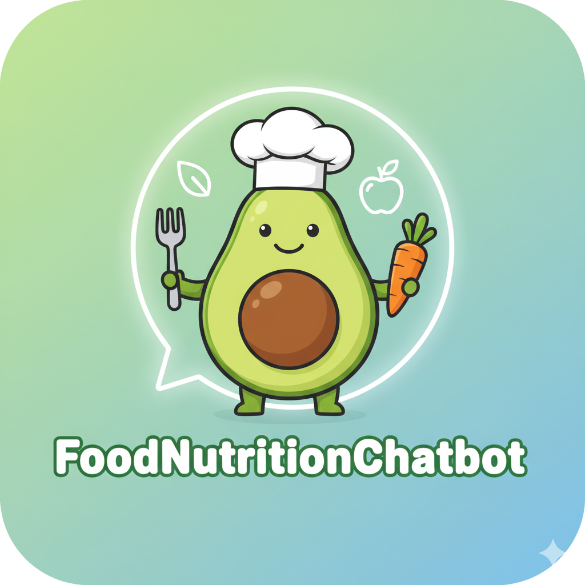

<!-- Improved compatibility of back to top link: See: https://github.com/othneildrew/Best-README-Template/pull/73 -->

<a id="readme-top"></a>

[![Contributors][contributors-shield]][contributors-url]
[![Forks][forks-shield]][forks-url]
[![Stargazers][stars-shield]][stars-url]
[![Issues][issues-shield]][issues-url]
[![project_license][license-shield]][license-url]

<br />
<div align="center">
  <a href="https://github.com/LoveDoLove-School-Projects/FoodNutritionChatbot">
    
  </a>

<h3 align="center">Smart Food Nutrition Chatbot</h3>

  <p align="center">
    An intelligent chatbot for food and nutrition analysis, powered by machine learning and natural language processing. It predicts meal types, analyzes nutrition, and provides food suggestions based on user queries.
    <br />
    <a href="https://github.com/LoveDoLove-School-Projects/FoodNutritionChatbot"><strong>Explore the docs »</strong></a>
    <br />
    <br />
    <a href="https://github.com/LoveDoLove-School-Projects/FoodNutritionChatbot">View Demo</a>
    &middot;
    <a href="https://github.com/LoveDoLove-School-Projects/FoodNutritionChatbot/issues/new?labels=bug&template=bug-report---.md">Report Bug</a>
    &middot;
    <a href="https://github.com/LoveDoLove-School-Projects/FoodNutritionChatbot/issues/new?labels=enhancement&template=feature-request---.md">Request Feature</a>
  </p>
</div>

<details>
  <summary>Table of Contents</summary>
  <ol>
    <li>
      <a href="#about-the-project">About The Project</a>
      <ul>
        <li><a href="#built-with">Built With</a></li>
      </ul>
    </li>
    <li>
      <a href="#getting-started">Getting Started</a>
      <ul>
        <li><a href="#prerequisites">Prerequisites</a></li>
        <li><a href="#installation">Installation</a></li>
      </ul>
    </li>
    <li><a href="#usage">Usage</a></li>
    <li><a href="#contributing">Contributing</a></li>
    <li><a href="#license">License</a></li>
    <li><a href="#contact">Contact</a></li>
    <li><a href="#acknowledgments">Acknowledgments</a></li>
  </ol>
</details>

## About The Project

Smart Food Nutrition Chatbot is a machine learning-based conversational assistant that helps users analyze food nutrition, predict meal types, and get healthy food suggestions. It leverages deep learning (TensorFlow/Keras), NLP, and a curated food dataset to provide accurate and interactive responses.

Key features:

- Predicts meal type (Low/Medium/High nutrition density) from food queries
- Analyzes nutrition facts and provides per-serving breakdowns
- Suggests similar foods and handles fuzzy/semantic queries
- Supports autocorrection, synonym matching, and user-friendly CLI

<p align="right">(<a href="#readme-top">back to top</a>)</p>

### Built With

- [TensorFlow/Keras](https://www.tensorflow.org/)
- [scikit-learn](https://scikit-learn.org/)
- [NLTK](https://www.nltk.org/)
- [fuzzywuzzy](https://github.com/seatgeek/fuzzywuzzy)
- [matplotlib](https://matplotlib.org/)
- [seaborn](https://seaborn.pydata.org/)
- [joblib](https://joblib.readthedocs.io/)
- [pandas](https://pandas.pydata.org/)
- [numpy](https://numpy.org/)
- [rich](https://github.com/Textualize/rich)

<p align="right">(<a href="#readme-top">back to top</a>)</p>

## Getting Started

To get a local copy up and running, follow these steps.

### Prerequisites

- Python 3.9+
- pip
- (Optional) conda for environment management

### Installation

1. Clone the repository:
   ```sh
   git clone https://github.com/LoveDoLove-School-Projects/FoodNutritionChatbot.git
   cd FoodNutritionChatbot
   ```
2. (Recommended) Create and activate a virtual environment:
   ```sh
   conda create --name foodnutri python=3.9
   conda activate foodnutri
   # or
   python -m venv venv
   venv\Scripts\activate  # Windows
   source venv/bin/activate  # Linux/Mac
   ```
3. Install dependencies:
   ```sh
   pip install tensorflow-cpu==2.10 tensorflow-directml-plugin numpy<2.0 pandas joblib scikit-learn fuzzywuzzy nltk matplotlib seaborn tabulate rouge_score pyyaml pulp ipywidgets python-Levenshtein autocorrect rich
   ```
4. Download NLTK data:
   ```python
   import nltk
   nltk.download('wordnet')
   nltk.download('omw-1.4')
   ```
5. (Optional) For GPU support, ensure compatible hardware and drivers.

<p align="right">(<a href="#readme-top">back to top</a>)</p>

## Usage

Run the chatbot CLI:

```sh
python Sources/ML-Based-ChatBot.ipynb
# or convert to .py and run:
# jupyter nbconvert --to script Sources/ML-Based-ChatBot.ipynb
# python Sources/ML-Based-ChatBot.py
```

Interact with the chatbot in your terminal. Example queries:

- "How many calories in 100g chicken breast?"
- "Suggest foods similar to broccoli."
- "Is oatmeal a high nutrition meal?"

The chatbot will analyze, predict, and respond with nutrition facts, meal type, and suggestions.

<p align="right">(<a href="#readme-top">back to top</a>)</p>

## Contributing

Contributions are welcome! Please fork the repo and submit a pull request, or open an issue for suggestions and bug reports.

1. Fork the Project
2. Create your Feature Branch (`git checkout -b feature/AmazingFeature`)
3. Commit your Changes (`git commit -m 'Add some AmazingFeature'`)
4. Push to the Branch (`git push origin feature/AmazingFeature`)
5. Open a Pull Request

<p align="right">(<a href="#readme-top">back to top</a>)</p>

### Top contributors:

<a href="https://github.com/LoveDoLove-School-Projects/FoodNutritionChatbot/graphs/contributors">
  
</a>

## License

Distributed under the MIT License. See `LICENSE` for more information.

<p align="right">(<a href="#readme-top">back to top</a>)</p>

## Contact

LoveDoLove - [@LoveDoLove](https://github.com/LoveDoLove)

Project Link: [https://github.com/LoveDoLove-School-Projects/FoodNutritionChatbot](https://github.com/LoveDoLove-School-Projects/FoodNutritionChatbot)

<p align="right">(<a href="#readme-top">back to top</a>)</p>

## Acknowledgments

- [Best-README-Template](https://github.com/othneildrew/Best-README-Template)
- [TensorFlow](https://www.tensorflow.org/)
- [scikit-learn](https://scikit-learn.org/)
- [NLTK](https://www.nltk.org/)
- [fuzzywuzzy](https://github.com/seatgeek/fuzzywuzzy)
- [matplotlib](https://matplotlib.org/)
- [seaborn](https://seaborn.pydata.org/)
- [joblib](https://joblib.readthedocs.io/)
- [pandas](https://pandas.pydata.org/)
- [numpy](https://numpy.org/)
- [rich](https://github.com/Textualize/rich)

<p align="right">(<a href="#readme-top">back to top</a>)</p>

[contributors-shield]: https://img.shields.io/github/contributors/LoveDoLove-School-Projects/FoodNutritionChatbot.svg?style=for-the-badge
[contributors-url]: https://github.com/LoveDoLove-School-Projects/FoodNutritionChatbot/graphs/contributors
[forks-shield]: https://img.shields.io/github/forks/LoveDoLove-School-Projects/FoodNutritionChatbot.svg?style=for-the-badge
[forks-url]: https://github.com/LoveDoLove-School-Projects/FoodNutritionChatbot/network/members
[stars-shield]: https://img.shields.io/github/stars/LoveDoLove-School-Projects/FoodNutritionChatbot.svg?style=for-the-badge
[stars-url]: https://github.com/LoveDoLove-School-Projects/FoodNutritionChatbot/stargazers
[issues-shield]: https://img.shields.io/github/issues/LoveDoLove-School-Projects/FoodNutritionChatbot.svg?style=for-the-badge
[issues-url]: https://github.com/LoveDoLove-School-Projects/FoodNutritionChatbot/issues
[license-shield]: https://img.shields.io/github/license/LoveDoLove-School-Projects/FoodNutritionChatbot.svg?style=for-the-badge
[license-url]: https://github.com/LoveDoLove-School-Projects/FoodNutritionChatbot/blob/master/LICENSE
[product-screenshot]: images/screenshot.png
